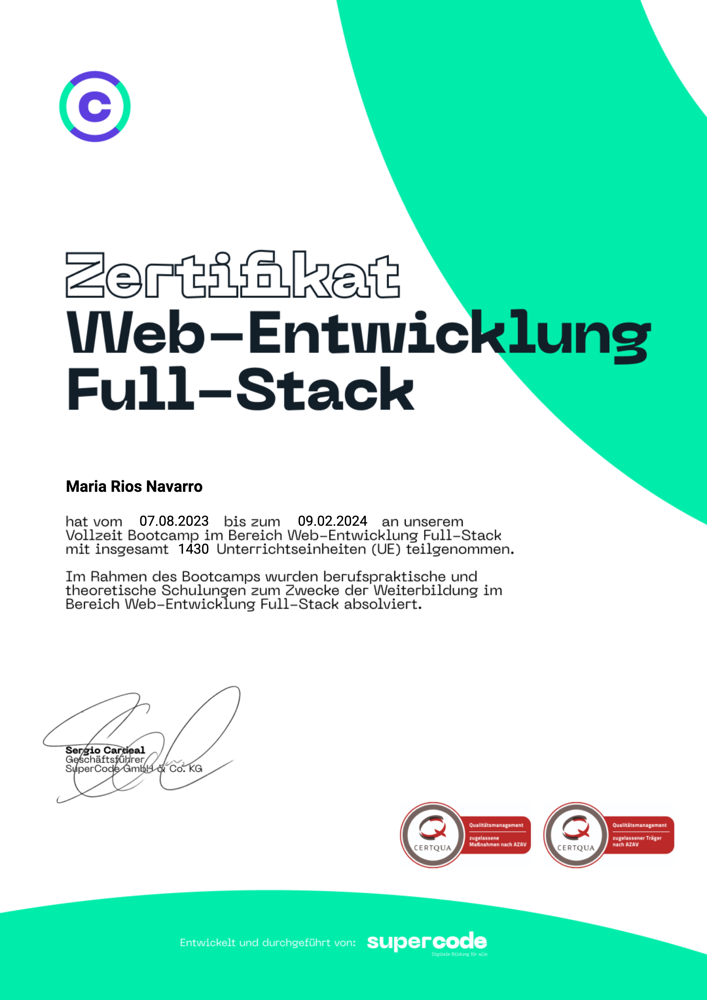

<!--
**MariaRiosNavarro/MariaRiosNavarro** is a ✨ _special_ ✨ repository because its `README.md` (this file) appears on your GitHub profile.-->

 

	

	<a href="mailto:info@propscode.com">E-Mail Contact</a>

	

	<a href="https://codesandbox.io/u/MariaRiosNavarro">CodeSandBox</a> 

	

	
- 🚀 Passionate about honing my programming skills, I thrive on analytical thinking, unyielding determination, and a creative problem-solving approach. Embracing change and adaptation, I'm always ready to craft innovative solutions

 

 <h2>🔥Skills🔥</h2>

 

<table style="text-alingt: center;">
  <tbody>
    <tr align="center">
      <td align="center"></td>
      <td align="center"></td>
      <td align="center"></td>
      <td align="center"></td>
    </tr>
    <tr>
      <td align="center"></td>
      <td align="center"></td>
      <td align="center"></td>
      <td align="center"></td>
    </tr>
    <tr>
     <td align="center"></td>
     <td align="center"></td>
      <td align="center"></td>
      <td align="center"></td>
    </tr>
    <tr>
      <td align="center"></td>
      <td align="center"></td>
      <td align="center"></td>
      <td align="center"></td>
    </tr>
    <tr>
      <td align="center">
      <td align="center"></td>
      <td align="center"></td>
      <td align="center"></td> 
    </tr>
    <tr>
      <td align="center"></td>
      <td align="center"></td>
      <td align="center"></td>
      <td align="center"></td>
    </tr>
  </tbody>
</table>

 <h2>👩🏽‍💻Activity👩🏽‍💻</h2>

 

 

	

 

 <h2>✨Portfolio✨</h2>

 
 

<table style="border-collapse: collapse;">
  <tbody>
    <tr style="border: none;">
     <td  style="border: none;" align="center"> <table><tr><th></th></tr><tr><td>
HTML + CSS + JS

Netlify

-Responsive-

Api Weather 

and Location App

(english)
</td></tr></table></td>
      <td style="border: none;" align="center"> <table><tr><th></th></tr><tr><td>
REACT + VITE + TAILWIND

DAISYUI + RENDER

-Responsive-

To Do App

with LIGHT/DARK mode

(english)</p</td></tr></table></td>
     <td style="border: none;" align="center"> <table><tr><th></th></tr><tr><td>
REACT+VITE+CSS

Vercel

-Desktop + Mobile-

Api Game Info Page

with LIGHT/DARK 

mode (english)
</td></tr></table></td>
    </tr>
    <tr style="border: none;">
      <td style="border: none;" align="center"> <table><tr><th></th></tr><tr><td>
HTML + CSS + JS

GitHubPages

-Mobile, Tablet, Desktop-

Rock-Paper-Scissors

Game

(english)
</td></tr></table></td>
      <td style="border: none;" align="center"> <table><tr><th></th></tr><tr><td>
HTML + CSS + JS 

GitHubPages

-Responsive-

Hangman MULTILINGUAL

Game

(english, german, spanish)
</td></tr></table></td>
      <td style="border: none;" align="center"> <table><tr><th></th></tr><tr><td>
HTML + SCSS + JS

GitHubPages

-Mobile, Tablet, Desktop-

Newsletter sign-up form 

with success message

(english)
</td></tr></table></td>
    </tr>
    <tr style="border: none;">
      <td style="border: none;" align="center"> <table><tr><th></th></tr><tr><td>
REACT + NEXT + 

Styled Components + Vercel

Responsive

Api Gallery Art

(english)

 
</td></tr></table></td>
      <td style="border: none;" align="center"> <table><tr><th></th></tr><tr><td>
REACT + VITE + CSS

Netlify

-Responsive

Api Pokemon 

with LIGHT/DARK mode
(english)
</td></tr></table></td>
      <td style="border: none;" align="center"> <table><tr><th></th></tr><tr><td>
REACT + VITE + TAILWIND 

DAISYUI + Netlify

-Mobile + Desktop-

Sorted-movies-app

(english)

 
</td></tr></table></td>
    </tr>
    <tr style="border: none;">
     <td style="border: none;" align="center"> <table><tr><th></th></tr><tr><td>
NEXT + REACT + MONGO/ATLAS

Cloudinary + OPENAI + Vercel

-Mobile First-

Mobile OS

Simulation

(german)
 </td></tr></table></td>
      <td style="border: none;" align="center"> <table><tr><th></th></tr><tr><td>
REACT + VITE + SCSS

 React Router + Vercel

-Responsive-

Bank App

(english)

 

 
</td></tr></table></td>
      <td style="border: none;" align="center"> <table><tr><th></th></tr><tr><td>
REACT + VITE + SCSS

Vercel

-Mobile, Tablet, Desktop-

Landing Page

(english)

 

 
</td></tr></table></td>
    </tr>
    <tr style="border: none;">
      <td style="border: none;" align="center"> <table><tr><th></th></tr><tr><td>
HTML + CSS + JS

GitHub Pages

-Mobile, Tablet, Desktop-

Api Gallery Art 

with PAGINATION

(english)</p</td></tr></table></td>
      <td style="border: none;" align="center"> <table><tr><th></th></tr><tr><td>
REACT + VITE + SCSS

Vercel

-Mobile

Api Beer App

(english)

  
</td></tr></table></td>
      <td style="border: none;" align="center"> <table><tr><th></th></tr><tr><td>
REACT + VITE + SCSS

Netlify

-Mobile, Tablet, Desktop-

 Loading Page 

& Light/Dark Mode

(english)</p</td></tr></table></td>
    </tr>
    <tr style="border: none;">
      <td style="border: none;" align="center"> <table><tr><th></th></tr><tr><td>
REACT + VITE + SCSS

Vercel

-Mobile, Tablet, Desktop-

Movie Db

(english)

</td></tr></table></td>
      <td style="border: none;" align="center"> <table><tr><th></th></tr><tr><td>
REACT + VITE + SCSS

Vercel

Desktop

Api E-commerce-shop

(english)

</td></tr></table></td>
      <td style="border: none;" align="center"> <table><tr><th></th></tr><tr><td>
HTML + CSS + JS

GitHub Pages

-Responsive-

Time & Clock Management

(english)

</td></tr></table></td>
    </tr>
    <tr style="border: none;">
      <td style="border: none;" align="center"> <table><tr><th></th></tr><tr><td>
HTML + CSS + JS

GitHub Pages

-Responsive-

JavaScript Cheat Sheet

(english)
 
 
</td></tr></table></td>
      <td style="border: none;" align="center"> <table><tr><th></th></tr><tr><td>
REACT + VITE + CSS

GitHub Pages

-Responsive-

Api Rick & Morty

with Pagination

 & Search(english)
</td></tr></table></td>
      <td style="border: none;" align="center"> <table><tr><th></th></tr><tr><td>
HTML + CSS + JS

GitHub Pages

-Responsive-

Euro-Vat-Calculator

 (german)

 
</td></tr></table></td>
    </tr>
    <tr style="border: none;">
      <td style="border: none;" align="center"> <table><tr><th></th></tr><tr><td>
HTML + CSS + JS

GitHub Pages

-Responsive-

MULTILINGUAL 

String Separator

(english, german, spanish)
</td></tr></table></td>
      <td style="border: none;" align="center"> <table><tr><th></th></tr><tr><td>
HTML + CSS + JS

GitHub Pages

-Responsive-

Calculate tax

(german tax)

from 2021 to 2023 (german)</p</td></tr></table></td>
      <td style="border: none;" align="center"> <table><tr><th></th></tr><tr><td>
HTML + CSS + JS

GitHub Pages

-Responsive-

Calorie Calculator 

with  Harris Benedict Formula

(german)
</td></tr></table></td>
    </tr>
    <tr style="border: none;">
      <td style="border: none;" align="center"> <table><tr><th></th></tr><tr><td>
HTML + CSS + JS

GitHub Pages

-Responsive-

Tip Calculator

(german)

  
</td></tr></table></td>
      <td style="border: none;" align="center"> <table><tr><th></th></tr><tr><td>
HTML + CSS + JS

GitHub Pages

-Responsive-

Simultaneous translator

to Morse code

(english/all)
</td></tr></table></td>
      <td style="border: none;" align="center"> <table><tr><th></th></tr><tr><td>
HTML + CSS + JS

GitHub Pages

-Responsive-

Cipher encryptor 

and decryptor(english)

  
</td></tr></table></td>
    </tr>
    <tr style="border: none;">
      <td style="border: none;" align="center"> <table><tr><th></th></tr><tr><td>
HTML + SCSS

GitHub Pages

-Mobile, Tablet, Desktop-

Langing Page 

Jewellery Shop (english)

   
</td></tr></table></td>
      <td style="border: none;" align="center"> <table><tr><th></th></tr><tr><td>
HTML + SCSS

GitHub Pages

-Mobile, Desktop-

Landing Page Wildfires
 in California (english)

   
</td></tr></table></td>
      <td style="border: none;" align="center"> <table><tr><th></th></tr><tr><td>
HTML + CSS

GitHub Pages

-Responsive-

Small Git + Github Cheat Sheet

(english)

   
</td></tr></table></td>
    </tr>
    <tr style="border: none;">
      <td style="border: none;" align="center"> <table><tr><th></th></tr><tr><td>
HTML + CSS

GitHub Pages

-Desktop, Mobile, Tablet-

Small Newsletter 

(english)

   
</td></tr></table></td>
      <td style="border: none;" align="center"> <table><tr><th></th></tr><tr><td>
HTML + CSS

GitHub Pages

-only Desktop-

Portfolio with 
 PARALAX images (english)

   
</td></tr></table></td>
      <td style="border: none;" align="center"> <table><tr><th></th></tr><tr><td>
HTML + CSS

GitHub Pages

-Responsive-

Small Responsive Card 

(english)

   
</td></tr></table></td>
    </tr>
    <tr style="border: none;">
      <td style="border: none;" align="center"> <table><tr><th></th></tr><tr><td>
HTML + CSS

GitHub Pages

-Desktop-

Landing Page about Cleos 

with PARALAX (english)

   
</td></tr></table></td>
      <td style="border: none;" align="center"> <table><tr><th></th></tr><tr><td>
HTML + CSS

GitHub Pages

 Desktop-

Small one Page
(english)

   
</td></tr></table></td>
<!-- <td style="border: none;" align="center"> <table><tr><th></th></tr><tr><td>
Techno

Deploy

Media

Description

(english)</p</td></tr></table></td>-->
    </tr>
  </tbody>
</table>

<!--Test

-->

-----------------------------------------------------------

 <h2>📃Certification📃</h2>

 

 

- 💻  Certification: Fullstack development (MERN) bootcamp at <a href="https://www.super-code.de/" target="_blank">"Supercode"</a>
 

 

 

- 💻  Certification: Web development bootcamp at <a href="https://www.neuefische.de/" target="_blank">"neue Fische"</a>
 

 

- 📃 Other Certification: freecodecamp
  
 

<a href="https://freecodecamp.org/certification/Propscode/responsive-web-design" target="_blank">[Free Code Camp Certification]</a>

-----------------------------------------------------------

 <h2>🔠Languages🔠</h2>

 

 
	
- 🗣️ I speak fluent German and English. Spanish and Catalan are my mother tongues.

-----------------------------------------------------------

 

 

