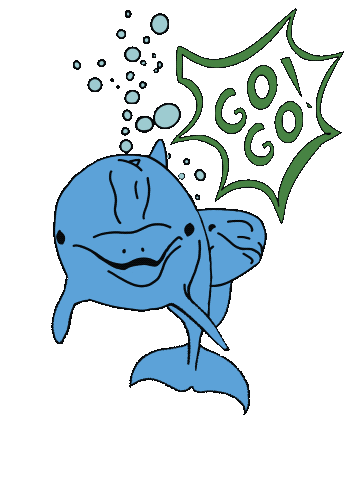

<!--
**MariaRiosNavarro/MariaRiosNavarro** is a ✨ _special_ ✨ repository because its `README.md` (this file) appears on your GitHub profile.-->

 

    <h2>Maria Rios Navarro</h2>

	<a href="mailto:info@propscode.com">E-Mail Contact</a> 

	
	

 

	
- 🎬 As a filmmaker (stand by props) with a great passion for new technological developments, I am looking for new challenges in the field of web development.  I am a dedicated, creative and self-motivated career changer. 

- 💻  I am completing the web development bootcamp at <a href="https://www.neuefische.de/" target="_blank">"neue Fische"</a> 

 

- 🔥 I’m currently learning **HTML, CSS, Javascript, REACT, NODE, NEXT.js, Local Storage, Backend, MONGO DB, Mongo ATLAS , Cloudinary, OPEN AI...** and new technologies&tools: 

	<code></code>
	<code></code>
	<code></code>
	<code></code>
	<code></code>
	<code></code>
	<code></code>
	<code></code>
	<code></code>
	<code></code>
	<code></code>

	

	
	
	
- 🗣️ I speak fluent German and English. Spanish and Catalan are my mother tongues.

- 📃 I recently finished my freecodecamp certificate.

<a href="https://freecodecamp.org/certification/Propscode/responsive-web-design" target="_blank">[Free Code Camp Certification]</a>

 

