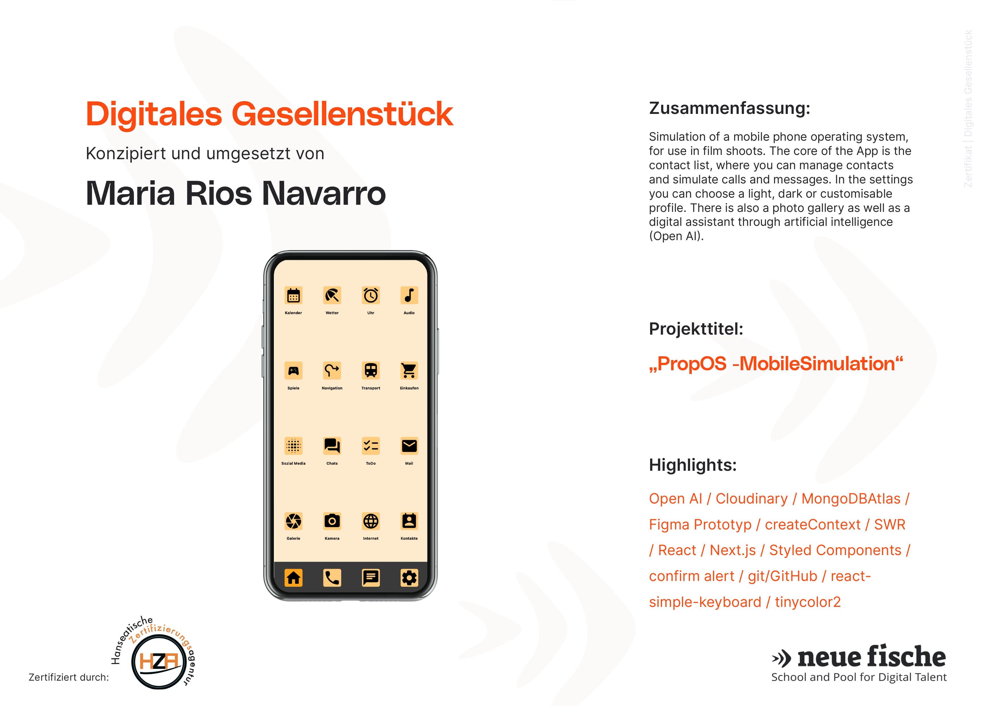

<!--
**MariaRiosNavarro/MariaRiosNavarro** is a ✨ _special_ ✨ repository because its `README.md` (this file) appears on your GitHub profile.-->

 

	

	<a href="mailto:info@propscode.com">E-Mail Contact</a>

	

	<a href="https://codesandbox.io/u/MariaRiosNavarro">CodeSandBox</a> 

	

	
- 🔥Passionate about honing my programming skills, I thrive on analytical thinking, unyielding determination, and a creative problem-solving approach. Embracing change and adaptation, I'm always ready to craft innovative solutions

 

- 🔥My skills are  **REACT**, **NEXT.js**, **Javascript**, **SCSS**, **Tailwind**, **Styled Components**, **MONGO DB** + **ATLAS** , **Cloudinary**, **OPEN AI**, **FIGMA** ... etc ...:  
 

|   |   |   |
|:---:|:---:|:---:|
||     |    |
|   |    |   |
|   |   |   |
|    |    |   |
|    |  |    |   
|    |     |   |  
|    |   |   |  
|   |   |   |  
|   |   |   |  
|   |   |   |  

	

 

-TEST

- Portfolio:
  

[Weather now](https://main--cool-vacherin-47a2af.netlify.app/)

[JavaScript Cheat Sheet](https://mariariosnavarro.github.io/jssheet/)

[PropOs - mobile simulation](https://mobile-simulation-prop-os.vercel.app/)

[Free2Game](https://free-to-game-v0-2.vercel.app/)

[PokemonApi](https://celadon-pika-f84b6a.netlify.app/)

[PROPS Movies Api](https://luxury-cendol-5bf0c6.netlify.app/)

[PROPS Tasks](https://simpletaskapp.onrender.com/)

[Architek Portfolio](https://spiffy-faloodeh-108a9f.netlify.app/)

[PROPS Bank](https://bank-app-rosy.vercel.app/)

[Beer App](https://beer-app-lovat.vercel.app/)

[E-Commerce-Shop](https://e-commerce-store-gamma-ten.vercel.app/)

[My Movie db](https://movie-db-liard-psi.vercel.app/)

[Rock-paper-scissors](https://mariariosnavarro.github.io/rock-paper-scissors/) - HTML + CSS + JS (Mobile, Tablet, Desktop) - Deployment: GitHubPages - Game

[Hangman](https://github.com/MariaRiosNavarro/hangman-game) - HTML + CSS + JS (Responsive) - Deployment: GitHubPages - MULTILINGUAL Game (english, german, spanish)

[Income-tax-calculation](https://mariariosnavarro.github.io/income-tax-calculation/) - HTML + CSS + JS (Responsive) - Deployment: GitHubPages -  Calculate tax from 2021 to 2023 (german tax)

[Morse-Decoder](https://mariariosnavarro.github.io/morse-decoder/)- HTML + CSS + JS (Responsive) - Deployment: GitHubPages - Simultaneous translator to Morse code

[Caesar-cipher](https://mariariosnavarro.github.io/caesar-cipher/)- HTML + CSS + JS (Responsive)- Deployment: GitHubPages -Cipher encryptor and decryptor.

[Clocks](https://mariariosnavarro.github.io/clocks/) - HTML + CSS + JS (Responsive) - Deployment: GitHubPages - Time & Clock Management - 

[Landing Page](https://landing-page-react-wine.vercel.app/) - React + Vite + Scss (Mobile, Tablet, Desktop)- Landing Page

[Picsum Gallery](https://mariariosnavarro.github.io/picsum-gallery/) - Api Gallery Art with PAGINATION

[Frontend Mentor - Newsletter sign](https://mariariosnavarro.github.io/newsletter-sign-up/) - HTML + SCSS + JS (Mobile, Tablet, Desktop) - Deployment: GitHubPages -  Newsletter sign-up form with success message challenge on Frontend Mentor.

[calorie-calculator](https://mariariosnavarro.github.io/calorie-calculator/)- HTML + CSS + JS (Responsive) - Deployment: GitHubPages - Calorie Calculator with  Harris Benedict Formula

[Euro-Vat-Calculator](https://mariariosnavarro.github.io/VAT-calculator-app/)- HTML + CSS + JS (Responsive) - Deployment: GitHubPages - Euro-Vat-Calculator (german language)

[String-separator](https://mariariosnavarro.github.io/string-separator/)- HTML + CSS + JS (Responsive) - Deployment: GitHubPages - MULTILINGUAL String Separator (english, german, spanish)

[Art Gallery](https://gallery-art-pink.vercel.app/)- React/Next - Styled Components (Responsive) -Deployment: Vercel - Api Gallery Art 

[Rick & More](https://mariariosnavarro.github.io/rickAndMortyApp/)- HTML + CSS + JS (Responsive) - Deployment: GitHubPages - Api Rick And Morty Gallery with SEARCH & PAGINATION

[Tip-calculator](https://mariariosnavarro.github.io/tip-calculator/)- HTML + CSS + JS (Responsive) - Deployment: GitHubPages - Tip Calculator (german language)

[Timeless](https://mariariosnavarro.github.io/timeless/) - HTML + SCSS - (Mobile, Tablet, Desktop) - Deployment: GitHubPages  - Langing Page Jewellery Shop (english language)

[California](https://mariariosnavarro.github.io/california/) - HTML + SCSS - (Mobile, Desktop) - Deployment: GitHubPages  - Landing Page Wildfires in California (english language)

[Git&GitHub Cheat Sheet](https://mariariosnavarro.github.io/gitSheet/)- HTML + CSS (Responsive) - Deployment: GitHubPages - Small Git + Github Cheat Sheet

[Super 7000 News](https://mariariosnavarro.github.io/newsletter/)- HTML + CSS (Desktop, Mobile, Tablet) - Deployment: GitHubPages - Small Newsletter

[Digital Designer Portfolio](https://mariariosnavarro.github.io/portfolio/)- HTML + CSS (only Desktop) - Deployment: GitHubPages - Portfolio with PARALAX images

[Diether Rams](https://mariariosnavarro.github.io/dieter-rams/) - HTML + CSS (Responsive) - Deployment: GitHubPages - Small Responsive Card 

[Cleos](https://mariariosnavarro.github.io/cleos/) - HTML + CSS (only Desktop) - Deployment: GitHubPages - Landing Page about Cleos with PARALAX images

[Shapely-demo](https://mariariosnavarro.github.io/shapely-demo/)  - HTML + CSS (only Desktop) - Deployment: GitHubPages - Small one Page

- 💻  Certifications: Web development bootcamp at <a href="https://www.neuefische.de/" target="_blank">"neue Fische"</a>
 

 

- 📃 Other certificate: freecodecamp
  
 

<a href="https://freecodecamp.org/certification/Propscode/responsive-web-design" target="_blank">[Free Code Camp Certification]</a>

 
	
- 🗣️ I speak fluent German and English. Spanish and Catalan are my mother tongues.

 

